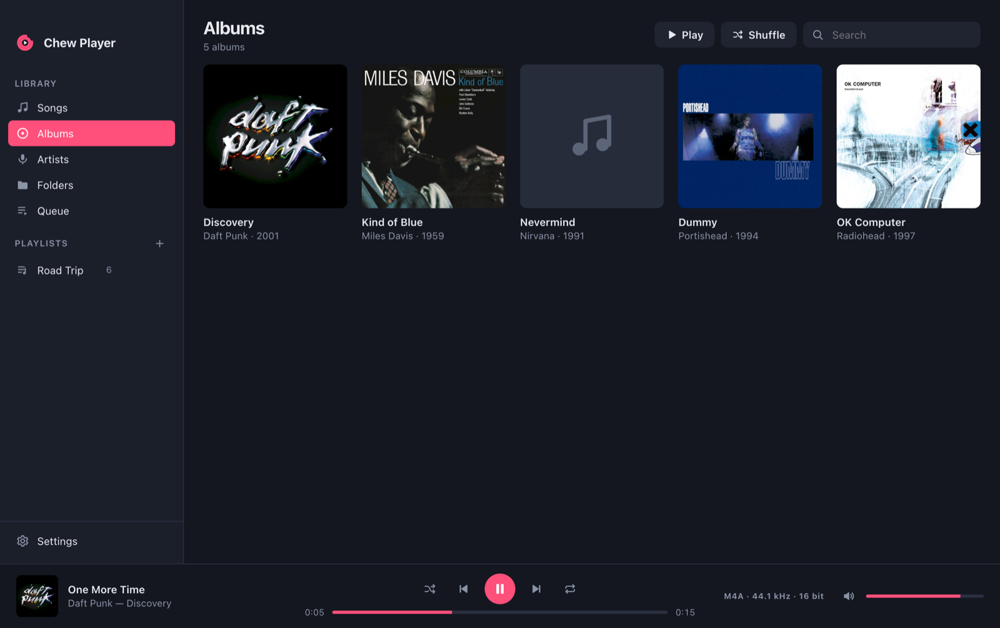

<p align="center">
  
</p>

<h1 align="center">Chew Player</h1>

<p align="center">
  A simple, folder-based music player for macOS and Windows — the way music players used to be.<br>
  <a href="https://fmatsch.github.io/chew-player/">Website</a> ·
  <a href="https://github.com/fmatsch/chew-player/releases/latest">Download</a>
</p>

<p align="center">
  
</p>

## Why

Your music lives in folders. Chew Player reads those folders and plays what's in them. No store, no
cloud, no subscription. It never moves, renames or rewrites your files.

## Features

- **Folder-based library**: add one or more music folders. Chew Player scans them and picks up
  changes on every rescan. You can browse by **Songs**, **Albums**, **Artists** or the actual
  **Folders** on disk.
- **Plays almost anything**: MP3, AAC/M4A, FLAC, Ogg Vorbis, Opus and WAV play natively. ALAC, AIFF,
  WMA, APE, WavPack, Musepack, DSD (DSF/DFF), TTA, AC3, MKA and more are decoded on the fly by the
  bundled FFmpeg.
- **Fills in missing info**: tags are read from the files first. If they're missing, Chew Player
  guesses them from the classic `Artist/Album (Year)/01 - Title` layout and then looks them up in the
  open [MusicBrainz](https://musicbrainz.org) database. Album art comes from embedded pictures, from
  `cover.jpg`/`folder.jpg` in the folder, or from the [Cover Art Archive](https://coverartarchive.org).
- **Playlists**: create, rename and reorder them by drag and drop. Import and export them as `.m3u`/`.m3u8`.
- **Queue, shuffle and repeat**: "Play Next", "Add to Queue", repeat all or repeat one.
- **Gapless playback**: tracks flow into each other without a pause, which matters for live and concept albums.
- **Volume leveling**: uses the ReplayGain (and Opus R128) values stored in your files. You can choose track, album or
  "smart" mode, which uses album gain when playing in order and track gain when shuffling. Peaks are protected from clipping.
- **Output device selection**: play through a USB DAC, headphones or any other device without changing the system default.
- **Watches your folders**: new, changed or deleted files are picked up automatically.
- **Picks up where you left off**: the queue and playback position are restored after a restart.
- **Updates**: on Windows, new versions download in the background and install on restart. On macOS you get a
  notification with a download link, because auto-installing needs a paid Apple signing certificate.
- **Edit info**: correct tags for one song or many at once. Your edits are stored in Chew Player's
  library, so the files themselves stay untouched.
- **Flat, quiet design**: light and dark themes that follow the system, and media keys.

## Download

Get the latest build from the [Releases page](https://github.com/fmatsch/chew-player/releases/latest):

| Platform | File |
| --- | --- |
| macOS (Apple Silicon) | `Chew-Player-mac-arm64.dmg` |
| macOS (Intel) | `Chew-Player-mac-x64.dmg` |
| Windows 10/11 (64-bit) | `Chew-Player-win-x64.exe` |

> **Note:** the builds are not notarised or code-signed with a paid certificate yet.
> - **macOS:** the first time, right-click the app and choose **Open**. If macOS says the app is
>   damaged, run `xattr -cr "/Applications/Chew Player.app"`.
> - **Windows:** SmartScreen may warn you. Click **More info → Run anyway**.

## Usage

1. Start Chew Player and click **Add Music Folder** (or drag a folder onto the window).
2. Wait for the scan to finish. Missing tags and album art are looked up in the background, and
   you can turn that off in **Settings**.
3. Double-click a song to play it. Right-click songs, albums or folders to queue them or add them
   to a playlist. You can also drag songs onto a playlist in the sidebar.

| Shortcut | Action |
| --- | --- |
| <kbd>Space</kbd> | Play / pause |
| <kbd>⌘/Ctrl</kbd> + <kbd>→</kbd> / <kbd>←</kbd> | Next / previous |
| <kbd>⌘/Ctrl</kbd> + <kbd>↑</kbd> / <kbd>↓</kbd> | Volume |
| <kbd>⌘/Ctrl</kbd> + <kbd>F</kbd> | Search |
| <kbd>⌘/Ctrl</kbd> + <kbd>O</kbd> | Add music folder |
| <kbd>⌘/Ctrl</kbd> + <kbd>N</kbd> | New playlist |
| <kbd>⌘/Ctrl</kbd> + <kbd>R</kbd> | Rescan library |
| <kbd>Enter</kbd> / <kbd>Delete</kbd> | Play selection / remove from playlist or queue |

## Development

Chew Player is an [Electron](https://www.electronjs.org) app written in plain JavaScript, with no
framework and no build step for the UI.

```bash
npm install
npm start            # run the app
npm run dist:mac     # build a .dmg into dist/
npm run dist:win     # build a Windows installer into dist/
npm run icons        # re-render the PNG icons from assets/*.svg
```

Project layout:

```
src/main/main.js      window, menus, IPC and the chew:// media protocol (byte ranges + FFmpeg streaming)
src/main/library.js   folder scanning, tag reading (music-metadata), playlists, JSON persistence
src/main/online.js    MusicBrainz + Cover Art Archive lookups (rate-limited to 1 req/s)
src/main/ffmpeg.js    FFmpeg discovery and on-the-fly decoding for exotic formats
src/main/updater.js   update checks (electron-updater on Windows, GitHub release check on macOS)
src/renderer/         the UI: views, virtualised track table, Web Audio player engine (gapless, ReplayGain)
docs/                 the GitHub Pages website
```

The library is stored as JSON in the app's user-data folder
(`~/Library/Application Support/Chew Player` on macOS, `%APPDATA%\Chew Player` on Windows).

For testing, `CHEW_USER_DATA=/some/dir` runs the app with a separate profile, and
`CHEW_CAPTURE=shot.png` saves a screenshot after start-up and quits.

Releases are built by GitHub Actions when you push a `v*` tag.

## License

[MIT](LICENSE). Binary releases include FFmpeg, which is licensed under the GPL.
Metadata comes from MusicBrainz (CC0) and cover art from the Cover Art Archive.
